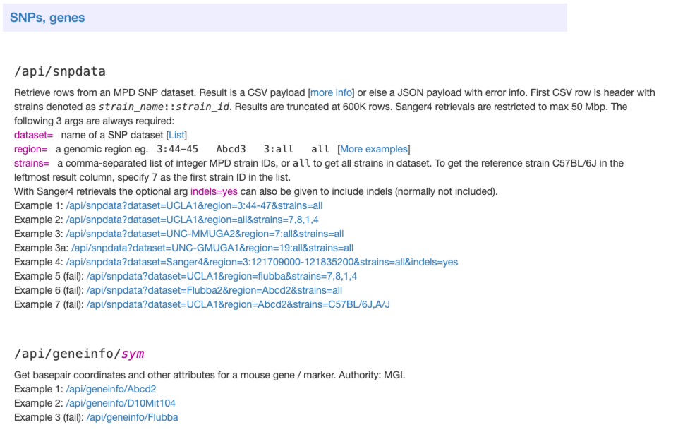
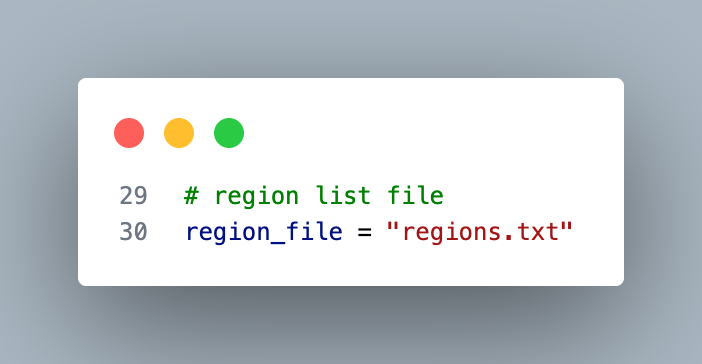

`MPD_API.py` - Batch download SNP/indel data from the Mouse Phenome Database (MPD) API

https://phenome.jax.org/about/api



**Requirements**

- Python 3.x
- `requests` library
- `pandas` library

Install dependencies with:

```bash
pip install requests pandas
```

**Run with**

replace input with your regions.txt in `MPD_API.py`




```bash
python MPD_API.py
```