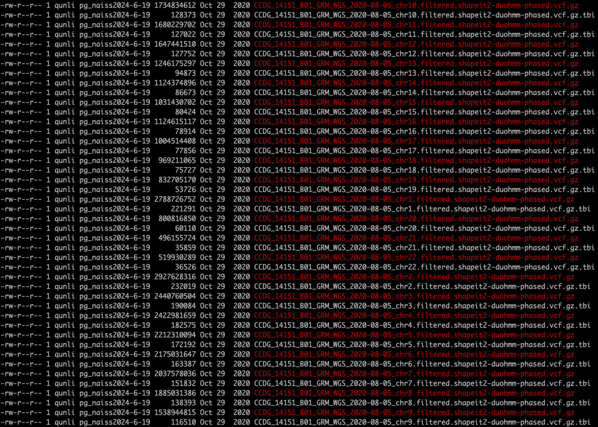
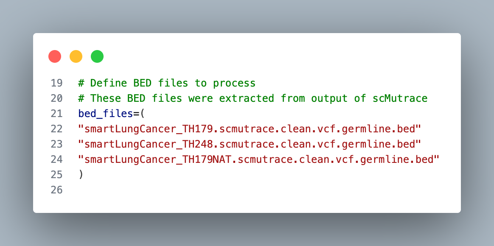

 This script maps germline variant positions from BED files to 1000 Genomes VCFs. For each BED file, it extracts matching VCF records from chromosome-specific 1KG VCFs, and writes them into a new VCF file with the appropriate header.

**Requirements**: bcftools, bash, and access to the specified VCF/BED files.

1KG VCFs can be download from following links:

- GRCh37: 
    - https://ftp.1000genomes.ebi.ac.uk/vol1/ftp/release/20130502/ 
    - https://bochet.gcc.biostat.washington.edu/beagle/1000_Genomes_phase3_v5a/b37.vcf/

- GRCh38 (This example)
    - https://ftp.1000genomes.ebi.ac.uk/vol1/ftp/data_collections/1000G_2504_high_coverage/working/20201028_3202_phased/

This example (GRCh38): 



**Run with**

BED files in `map1000genome.sh` were extracted from output of scMutrace


```bash
bash map1000genome.sh
```