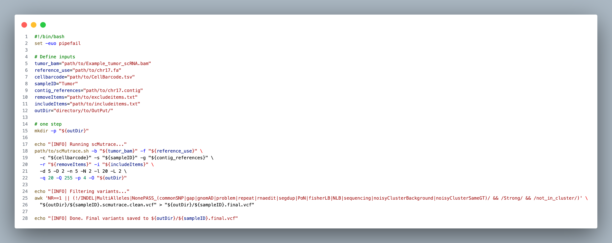

# Example 1: Identify somatic mutations without control sample and celltype annotation

> Example BAM files from same sample (Data folder) were derived from 10x Genomics single-cell sequencing data, and contain a small region of human chromosome 17 (hg19), which harbors four somatic mutations. (Due to ethical considerations, the BAM file headers and other metadata have been masked)


- scRNA
    - `Example_tumor_scRNA.bam`: scRNA sequencing tumor tissue (We only use this file in our script)
    - `Example_normal_scRNA.bam`: scRNA sequencing normal tissue
- WES
    - `Example_tumor_WES.bam`: WES sequencing tumor tissue
    - `Example_normal_WES.bam`: WES sequencing normal tissue

## Step 1: Install scMutrace
Install scMutrace following the instructions provided at:

https://github.com/QunATCG/scMutrace#installation

## Step 2: Download example data and prerequisite files
<details>
<summary>Option 1: One-step setup </summary>

### Option 1.1 Download example data

### Option 1.1 Run scMutrace with one-step mode
</details>

<details>
<summary>Option 2: Step-by-step script configuration </summary>

### Option 2.1 Download example data

**make sure to place this in a location with plenty of space**
1. Download bam files from [here](https://github.com/QunATCG/scMutrace-tutorial/tree/main/QuickStart/Example1/Data).
2. Download meta files from [here](https://github.com/QunATCG/scMutrace-tutorial/tree/main/QuickStart/Example1/Meta)
3. Download scMutrace databases from [here](https://doi.org/10.5281/zenodo.16962722). (input file format: [scMutrace_databases](https://github.com/QunATCG/scMutrace-tutorial/blob/main/QuickStart/Example1/Meta/excludeitems.txt))

### Option 2.2 Run scMutrace with one-step mode

**Replace the default input path and output directory with your own file locations**.

*This example is expected to complete in about 2 minutes, using 36 GB of memory and 4 CPU cores.*

```bash
# Activate conda environment if needed
conda activate scMutrace
```
You must **replace the paths below with your own local paths** (shown here as examples and highlighted for clarity)



Create a bash script named run_example_1.sh with the following content, then execute it using `bash run_example_1.sh` in your terminal. Before running the script, replace all paths (shown above) with your own local paths.
Make sure the paths specified in `excludeitems.txt` and `includeitems.txt` are valid

```bash
#!/bin/bash
set -euo pipefail

# Define inputs
tumor_bam="path/to/Example_tumor_scRNA.bam"
reference_use="path/to/chr17.fa"
cellbarcode="path/to/CellBarcode.tsv"
sampleID="Tumor"
contig_references="path/to/chr17.contig"
# Check database paths in excludeitems.txt and includeitems.txt before running the script
# Check database paths in excludeitems.txt and includeitems.txt before running the script
removeItems="path/to/excludeitems.txt"
includeItems="path/to/includeitems.txt"
outDir="directory/to/OutPut/"

# one step
mkdir -p "${outDir}"

echo "[INFO] Running scMutrace..."
path/to/scMutrace.sh -b "${tumor_bam}" -f "${reference_use}" \
  -c "${cellbarcode}" -s "${sampleID}" -g "${contig_references}" \
  -r "${removeItems}" -i "${includeItems}" \
  -d 5 -D 2 -n 5 -N 2 -l 20 -L 2 \
  -q 20 -Q 255 -p 4 -O "${outDir}"

echo "[INFO] Filtering variants..."
awk 'NR==1 || (!/INDEL|MultiAlleles|NonePASS_(commonSNP|gap|gnomAD|problem|repeat|rnaedit|segdup|PoN|fisherLB|NLB|sequencing|noisyClusterBackground|noisyClusterSameGT)/ && /Strong/ && /not_in_cluster/)' \
  "${outDir}/${sampleID}.scmutrace.clean.vcf" > "${outDir}/${sampleID}.final.vcf"

echo "[INFO] Done. Final variants saved to ${outDir}/${sampleID}.final.vcf"
```

> awk is a powerful Unix command-line tool designed for text processing and data extraction and is often regarded as a lightweight programming language. It splits each line into fields using a delimiter (default is any whitespace) and lets you define patterns to match and actions to execute when those patterns are met:
[sed, awk, vmstat and nestat commands](https://www.youtube.com/watch?v=4hJorSKg9E0)

</details>

## Step 3: Check output files
In output folder, you can find following files.

| Name | Description |
| -------- | ------- |
| barcodeList.txt | List of all cell barcodes used to filter BAM reads |
| ExcludeBG_Tumor.picard_dup_metrics.txt | Metrics file from Picard marking duplicated reads |
| ExcludeBG_Tumor.sort.bam | Filtered BAM file based on the cell barcode list |
| ExcludeBG_Tumor.sort.bam.bai | index file of ExcludeBG_Tumor.sort.bam |
| ExcludeBG_Tumor.sort.rmdupicard.bam | BAM file after removing duplicated reads using Picard |
| ExcludeBG_Tumor.sort.rmdupicard.bam.bai | index file of ExcludeBG_Tumor.sort.rmdupicard.bam |
| filterVCF folder | Folder containing filtered SNPs produced by scMutrace |
| tmp folder | Temporary working directory |
| tmpVCF folder | Temporary files related to VCF generation |
| VCFPOS folder | Temporary files related to VCF generation |
| Tumor_scmutrace.vcf | all SNPs |
| Tumor.scmutrace.clean.vcf | output of scMutrace with all annotations |
| Tumor.final.vcf | final result of scMutrace |

# You can check all SNVs using IGV tool
Example scMutrace output can be downloaded from [here](https://github.com/QunATCG/scMutrace-tutorial/blob/main/QuickStart/Example1/outputExample/Tumor.final.vcf)

Example [log file](./outputExample/log.txt)

- Four somatic mutations (can be found in Tumor.final.vcf):
    - scRNA specific [17_1549588_G_A](../../Figures/Example1/17_1549588_G_A.png)
    - both scRNA and WES [17_7951909_G_A](../../Figures/Example1/17_7951909_G_A.png)
    - both scRNA and WES [17_40169488_C_T](../../Figures/Example1/17_40169488_C_T.png)
    - both scRNA and WES [17_65688765_C_T](../../Figures/Example1/17_65688765_C_T.png)

- One germline mutations (can be found in Tumor.scmutrace.clean.vcf):
    - [17_40169519_G_T](../../Figures/Example1/17_40169519_G_T.png)

- Other noisy mutation (can be found in Tumor.scmutrace.clean.vcf):
    - [17_4475803_C_A](../../Figures/Example1/17_4475803_C_A.png)
    - [17_59667948_A_G](../../Figures/Example1/17_59667948_A_G.png)

