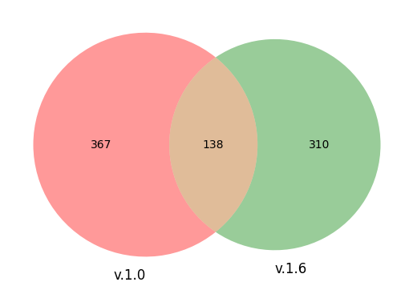

# Example 3: Identify somatic mutations without control sample and celltype annotation

> Example BAM files from same sample (Data folder) were derived from Monopogen example data (you can compare the differences between two methods), and contain a small region of human chromosome 20 (hg38).

- scRNA
    - `chr20.maester_scRNA_CB.bam`: scRNA sequencing tumor tissue (We only use this file in our script and we add CB tag for all reads using `setBarcode.py`)

```bash
# Activate conda environment if needed
conda activate scMutrace
# setBarcode.py can be found in Meta folder
python setBarcode.py --bam chr20.maester_scRNA.bam --outbam chr20.maester_scRNA_CB.bam --buffer_size 500000
```

## Step 1: Install scMutrace
Install scMutrace following the instructions provided at:

https://github.com/QunATCG/scMutrace#installation

## Step 2: Download example data and run the pipeline

<details>
<summary> <b> Option 1: One-step setup (recommended) </b> </summary>

### Option 1.1 Download example data
- 1. Download scMutrace example from [here](./Data/Example3.zip)
- 2. Download scMutrace databases from [here](https://doi.org/10.5281/zenodo.16962722). (input file format: [scMutrace_databases](https://github.com/QunATCG/scMutrace-tutorial/blob/main/QuickStart/Example1/Meta/excludeitems.txt))

### Option 1.2 Run scMutrace

Replace the `scMutrace_databases_directory` and `scMutrace_script_directory` with your own file locations.

This example is expected to complete in about 15 minutes, using 36 GB of memory and 4 CPU cores.

You can run this example in your terminal using

```bash
# Activate conda environment if needed
conda activate scMutrace

bash run.sh -d scMutrace_databases_directory -s scMutrace_script_directory
```
</details>

<details>
<summary> <b> Option 2: Step-by-step customizable script configuration </b> </summary>

### Option 2.1 Download example data

**make sure to place this in a location with plenty of space**
1. Download BAM file from [here](./Data/). 
2. Download meta files from [here](https://github.com/QunATCG/scMutrace-tutorial/tree/main/QuickStart/Example3/Meta)
3. Download scMutrace databases from [here](https://doi.org/10.5281/zenodo.16962722). (format: [scMutrace_databases](https://github.com/QunATCG/scMutrace-tutorial/blob/main/QuickStart/Example3/Meta/excludeitems.txt))

### Option 2.2 Run scMutrace with one-step mode

**Replace the default input path and output directory with your own file locations**.

*This example is expected to complete in about 15 minutes, using 36 GB of memory and 4 CPU cores.*

```bash
# Activate conda environment if needed
conda activate scMutrace
```

You must **replace the paths below with your own local paths** (shown here as examples and highlighted for clarity)


Create a bash script named run_example_3.sh with the following content, then execute it using `bash run_example_3.sh` in your terminal. Before running the script, replace all paths (shown above) with your own local paths.
Make sure the paths specified in `excludeitems.txt` and `includeitems.txt` are valid

```bash
#!/bin/bash
set -euo pipefail

# Define inputs
tumor_bam="path/to/chr20.maester_scRNA_CB.bam"
reference_use="path/to/genome.20.fa"
cellbarcode="path/to/CellBarcode.tsv"
sampleID="Tumor"
contig_references="path/to/chr20.contig"
# Check database paths in excludeitems.txt and includeitems.txt before running the script
# Check database paths in excludeitems.txt and includeitems.txt before running the script
removeItems="path/to/excludeitems.txt"
includeItems="path/to/includeitems.txt"
outDir="path/to/OutPut/"

mkdir -p "${outDir}"

# This bam file MAX MQ is 60
echo "[INFO] Running scMutrace..."
/Users/liqun/Desktop/scMutrace/scMutrace.sh -b "${tumor_bam}" -f "${reference_use}" \
  -c "${cellbarcode}" -s "${sampleID}" -g "${contig_references}" \
  -r "${removeItems}" -i "${includeItems}" \
  -d 5 -D 2 -n 5 -N 2 -l 20 -L 2  \
  -q 20 -Q 60 -p 4 -O "${outDir}"

echo "[INFO] Filtering variants..."
awk 'NR==1 || (!/INDEL|MultiAlleles|NonePASS_(commonSNP|gap|gnomAD|problem|repeat|rnaedit|segdup|PoN|fisherLB|NLB|sequencing|noisyClusterBackground|noisyClusterSameGT)/ && /Strong/ && /not_in_cluster/)' \
  "${outDir}/${sampleID}.scmutrace.clean.vcf" > "${outDir}/${sampleID}.final.vcf"

echo "[INFO] Done. Final variants saved to ${outDir}/${sampleID}.final.vcf"
```

> awk is a powerful Unix command-line tool designed for text processing and data extraction and is often regarded as a lightweight programming language. It splits each line into fields using a delimiter (default is any whitespace) and lets you define patterns to match and actions to execute when those patterns are met:
[sed, awk, vmstat and nestat commands](https://www.youtube.com/watch?v=4hJorSKg9E0)

</details>

## Step 3: Check output files
In output folder, you can find following files.

| Name | Description |
| -------- | ------- |
| barcodeList.txt | List of all cell barcodes used to filter BAM reads |
| ExcludeBG_Tumor.picard_dup_metrics.txt | Metrics file from Picard marking duplicated reads |
| ExcludeBG_Tumor.sort.bam | Filtered BAM file based on the cell barcode list |
| ExcludeBG_Tumor.sort.bam.bai | index file of ExcludeBG_Tumor.sort.bam |
| ExcludeBG_Tumor.sort.rmdupicard.bam | BAM file after removing duplicated reads using Picard |
| ExcludeBG_Tumor.sort.rmdupicard.bam.bai | index file of ExcludeBG_Tumor.sort.rmdupicard.bam |
| filterVCF folder | Folder containing filtered SNPs produced by scMutrace |
| tmp folder | Temporary working directory |
| tmpVCF folder | Temporary files related to VCF generation |
| VCFPOS folder | Temporary files related to VCF generation |
| Tumor_scmutrace.vcf | all SNPs |
| Tumor.scmutrace.clean.vcf | output of scMutrace with all annotations |
| Tumor.final.vcf | final result of scMutrace |

**output of scMutrace**:

Example scMutrace output can be downloaded from [here](https://github.com/QunATCG/scMutrace-tutorial/blob/main/QuickStart/Example3/outputExample/Tumor.final.vcf)

Example [log file](./outputExample/log.txt)


**output of Monopogen**:
- [Monopogen Document](https://github.com/KChen-lab/Monopogen)

Example Monopogen outputs, including both the [raw](./outputExample/Monopogen_chr20.putativeSNVs_raw.csv) and [filtered](./outputExample/Monopogen_chr20.putativeSNVs_filtered.csv) result files.

*This example is expected to complete in about 45 minutes when using Monopogen (using 80 GB of memory and 1 CPU core), Note, the option -t enables users to run mulitple chromosomes simultaneously. Set -t=1 if you are working on only one chromosome*

*Due to differences in the version of Monopogen and in the annotation files (imputation_panel and LDrefinement step), the results may vary substantially (~25% of the variants differ between versions). We recommend consulting the Monopogen documentation for details.*

- [Different somatic calls across Monopogen v.1.0 and v1.6.0 #58](https://github.com/KChen-lab/Monopogen/issues/58)



- [Version issue backup](../../Figures/Example3/VersionIssue.pdf)

Example Monopogen Github page output can be found [here](https://github.com/KChen-lab/Monopogen/tree/main/example)

*Because Monopogen outputs can vary substantially, we recommend manually inspecting the identified somatic mutations using IGV.*