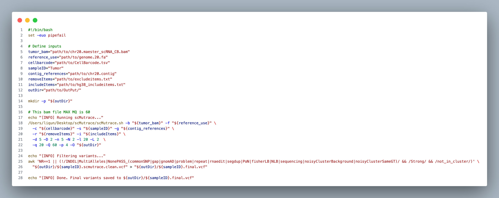
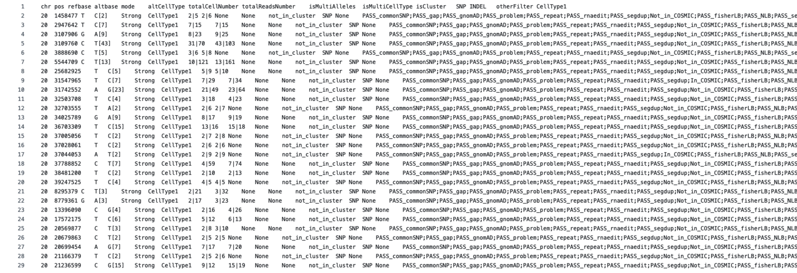

# Example 3: Identify somatic mutations without control sample and celltype annotation

> Example BAM files from same sample (Data folder) were derived from Monopogen example data (you can compare the differences between two methods), and contain a small region of human chromosome 20 (hg38), which harbors five somatic mutations.

- scRNA
    - `chr20.maester_scRNA_CB.bam`: scRNA sequencing tumor tissue (We only use this file in our script and we add CB tag for all reads using `setBarcode.py`)

```bash
# Activate conda environment if needed
conda activate scMutrace
```

```bash
# setBarcode.py can be found in Meta folder
python setBarcode.py --bam chr20.maester_scRNA.bam --outbam chr20.maester_scRNA_CB.bam --buffer_size 500000
```

## Step 1: Install scMutrace
Install scMutrace following the instructions provided at:

https://github.com/QunATCG/scMutrace#installation

## Step 2: Download example data and prerequisite files
**make sure to place this in a location with plenty of space**
1. Download raw bam file from [here](https://drive.google.com/file/d/1wj5KvYXc0uWIT9G2jnIbqSgfPaODyWyu/view?usp=drive_link) and processed file from [here](https://drive.google.com/file/d/1tKAw8q70_7QnN5RxvKf2GfEngUP_xAXI/view?usp=drive_link).
2. Download meta files from [here](https://github.com/QunATCG/scMutrace-tutorial/tree/main/QuickStart/Example3/Meta)
3. Download scMutrace databases from [here](). (format: [scMutrace_databases](https://github.com/QunATCG/scMutrace-tutorial/blob/main/QuickStart/Example3/Meta/excludeitems.txt))

## Step 3: Run scMutrace with one-step mode
**Replace the default input path and output directory with your own file locations**.

*This example is expected to complete in about 15 minutes, using 36 GB of memory and 4 CPU cores.*

```bash
# Activate conda environment if needed
conda activate scMutrace
```

```bash
#!/bin/bash
set -euo pipefail

# Define inputs
tumor_bam="path/to/chr20.maester_scRNA_CB.bam"
reference_use="path/to/genome.20.fa"
cellbarcode="path/to/CellBarcode.tsv"
sampleID="Tumor"
contig_references="path/to/chr20.contig"
removeItems="path/to/excludeitems.txt"
includeItems="path/to/hg38_includeitems.txt"
outDir="path/to/OutPut/"

mkdir -p "${outDir}"

# This bam file MAX MQ is 60
echo "[INFO] Running scMutrace..."
/Users/liqun/Desktop/scMutrace/scMutrace.sh -b "${tumor_bam}" -f "${reference_use}" \
  -c "${cellbarcode}" -s "${sampleID}" -g "${contig_references}" \
  -r "${removeItems}" -i "${includeItems}" \
  -d 5 -D 2 -n 5 -N 2 -l 20 -L 2  \
  -q 20 -Q 60 -p 4 -O "${outDir}"

echo "[INFO] Filtering variants..."
awk 'NR==1 || (!/INDEL|MultiAlleles|NonePASS_(commonSNP|gap|gnomAD|problem|repeat|rnaedit|segdup|PoN|fisherLB|NLB|sequencing|noisyClusterBackground|noisyClusterSameGT)/ && /Strong/ && /not_in_cluster/)' \
  "${outDir}/${sampleID}.scmutrace.clean.vcf" > "${outDir}/${sampleID}.final.vcf"

echo "[INFO] Done. Final variants saved to ${outDir}/${sampleID}.final.vcf"
```


> awk is a powerful Unix command-line tool—best thought of as a mini programming language—designed for text processing and data extraction. It splits each line into fields using a delimiter (default is any whitespace) and lets you define patterns to match and actions to execute when those patterns are met:
[sed, awk, vmstat and nestat commands](https://www.youtube.com/watch?v=4hJorSKg9E0)

## Step 4: Check output files
In output folder, you can find following files.

| Name | Description |
| -------- | ------- |
| barcodeList.txt | List of all cell barcodes used to filter BAM reads |
| ExcludeBG_Tumor.picard_dup_metrics.txt | Metrics file from Picard marking duplicated reads |
| ExcludeBG_Tumor.sort.bam | Filtered BAM file based on the cell barcode list |
| ExcludeBG_Tumor.sort.bam.bai | index file of ExcludeBG_Tumor.sort.bam |
| ExcludeBG_Tumor.sort.rmdupicard.bam | BAM file after removing duplicated reads using Picard |
| ExcludeBG_Tumor.sort.rmdupicard.bam.bai | index file of ExcludeBG_Tumor.sort.rmdupicard.bam |
| filterVCF folder | Folder containing filtered SNPs produced by scMutrace |
| tmp folder | Temporary working directory |
| tmpVCF folder | Temporary files related to VCF generation |
| VCFPOS folder | Temporary files related to VCF generation |
| Tumor_scmutrace.vcf | all SNPs |
| Tumor.scmutrace.clean.vcf | output of scMutrace with all annotations |
| Tumor.final.vcf | final result of scMutrace |

**output of scMutrace**:

example scMutrace output can be downloaded from [here](https://github.com/QunATCG/scMutrace-tutorial/blob/main/QuickStart/Example3/outputExample/scMutrace.vcf)



**output of Monopogen**:

*This example is expected to complete in about 46 minutes when using Monopogen (using 36 GB of memory and 1 CPU core), Note, the option -t enables users to run mulitple chromosomes simultaneously. Set -t=1 if you are working on only one chromosome*

*Due to differences in the version of Monopogen and in the annotation files (imputation_panel and LDrefinement step), the results may vary substantially (~25% of the variants differ between versions). We recommend consulting the Monopogen documentation for details.*

- [Monopogen Document](https://github.com/KChen-lab/Monopogen)

- [Different somatic calls across Monopogen v.1.0 and v1.6.0 #58](https://github.com/KChen-lab/Monopogen/issues/58)

- [Version issue backup](../../Figures/Example3/VersionIssue.pdf)

example Monopogen output can be found [here](https://github.com/KChen-lab/Monopogen/tree/main/example)