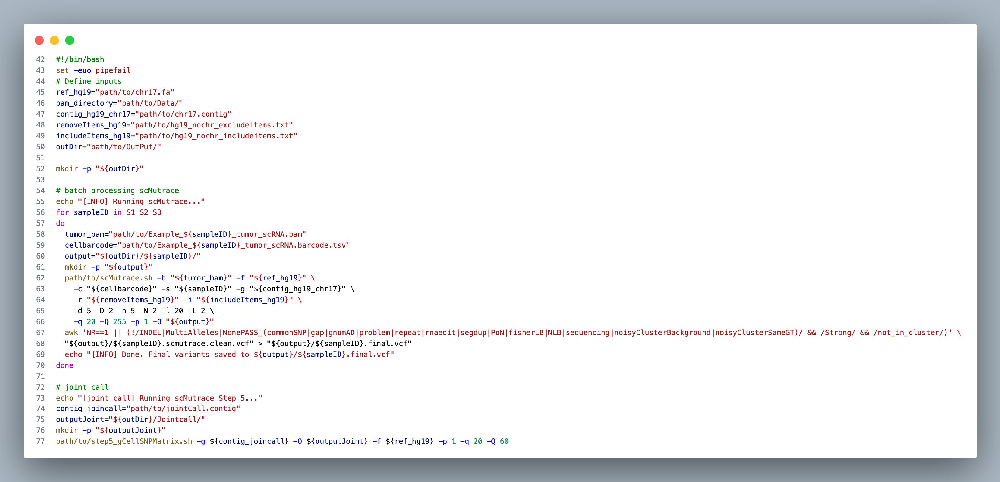
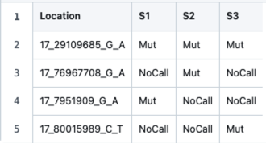

# Example 3: Identify somatic mutations with joint calling strategy
> Example BAM files from same sample (Data folder) were derived from 10x Genomics single-cell sequencing data, and contain a small region of human chromosome 17 (hg19), which harbors one somatic mutations. (Due to ethical considerations, the BAM file headers and other metadata have been masked)

- scRNA
    - `Example_S1_tumor_scRNA.bam`: scRNA sequencing tumor tissue of sample1 (We only use this file in our script)
    - `Example_S1_normal_scRNA.bam`: scRNA sequencing normal tissue of sample1
    - `Example_S2_tumor_scRNA.bam`: scRNA sequencing tumor tissue of sample2 (We only use this file in our script)
    - `Example_S2_normal_scRNA.bam`: scRNA sequencing normal tissue of sample2
    - `Example_S3_tumor_scRNA.bam`: scRNA sequencing tumor tissue of sample3 (We only use this file in our script)
    - `Example_S3_normal_scRNA.bam`: scRNA sequencing normal tissue of sample3

- WES
    - `Example_S1_tumor_WES.bam`: WES sequencing tumor tissue of sample1
    - `Example_S1_normal_WES.bam`: WES sequencing normal tissue of sample1
    - `Example_S2_tumor_WES.bam`: WES sequencing tumor tissue of sample2
    - `Example_S2_normal_WES.bam`: WES sequencing normal tissue of sample2
    - `Example_S3_tumor_WES.bam`: WES sequencing tumor tissue of sample3
    - `Example_S3_normal_WES.bam`: WES sequencing normal tissue of sample3

## Step 1: Install scMutrace
Install scMutrace following the instructions provided at:

https://github.com/QunATCG/scMutrace#installation

## Step 2: Download example data and prerequisite files
**make sure to place this in a location with plenty of space**
1. Download bam files from [here](https://github.com/QunATCG/scMutrace-tutorial/tree/main/QuickStart/Example4/Data).
2. Download meta files from [here](https://github.com/QunATCG/scMutrace-tutorial/tree/main/QuickStart/Example4/Meta)
3. Download scMutrace databases from [here](https://doi.org/10.5281/zenodo.16962722). (input file format: [scMutrace_databases](https://github.com/QunATCG/scMutrace-tutorial/blob/main/QuickStart/Example1/Meta/excludeitems.txt))

## Step 3: Run scMutrace with one-step mode
**Replace the default input path and output directory with your own file locations**.

*This example is expected to complete in about 2 minutes, using 36 GB of memory and 4 CPU cores.*

```bash
# Activate conda environment if needed
conda activate scMutrace
```

```bash
#!/bin/bash
set -euo pipefail
# Define inputs
ref_hg19="path/to/chr17.fa"
bam_directory="path/to/Data/"
contig_hg19_chr17="path/to/chr17.contig"
# Check database paths in excludeitems.txt and includeitems.txt before running the script
# Check database paths in excludeitems.txt and includeitems.txt before running the script
removeItems_hg19="path/to/excludeitems.txt"
includeItems_hg19="path/to/includeitems.txt"
outDir="path/to/OutPut/"

mkdir -p "${outDir}"

# batch processing scMutrace
echo "[INFO] Running scMutrace..."
for sampleID in S1 S2 S3
do
  tumor_bam="path/to/Example_${sampleID}_tumor_scRNA.bam"
  cellbarcode="path/to/Example_${sampleID}_tumor_scRNA.barcode.tsv"
  output="${outDir}/${sampleID}/"
  mkdir -p "${output}"
  path/to/scMutrace.sh -b "${tumor_bam}" -f "${ref_hg19}" \
    -c "${cellbarcode}" -s "${sampleID}" -g "${contig_hg19_chr17}" \
    -r "${removeItems_hg19}" -i "${includeItems_hg19}" \
    -d 5 -D 2 -n 5 -N 2 -l 20 -L 2 \
    -q 20 -Q 255 -p 1 -O "${output}"
  awk 'NR==1 || (!/INDEL|MultiAlleles|NonePASS_(commonSNP|gap|gnomAD|problem|repeat|rnaedit|segdup|PoN|fisherLB|NLB|sequencing|noisyClusterBackground|noisyClusterSameGT)/ && /Strong/ && /not_in_cluster/)' \
  "${output}/${sampleID}.scmutrace.clean.vcf" > "${output}/${sampleID}.final.vcf"
  echo "[INFO] Done. Final variants saved to ${output}/${sampleID}.final.vcf"
done

# joint call
echo "[joint call] Running scMutrace Step 5..."
contig_joincall="path/to/jointCall.contig"
outputJoint="${outDir}/Jointcall/"
mkdir -p "${outputJoint}"
path/to/step5_gCellSNPMatrix.sh -g ${contig_joincall} -O ${outputJoint} -f ${ref_hg19} -p 1 -q 20 -Q 60
```



> awk is a powerful Unix command-line tool—best thought of as a mini programming language—designed for text processing and data extraction. It splits each line into fields using a delimiter (default is any whitespace) and lets you define patterns to match and actions to execute when those patterns are met:
[sed, awk, vmstat and nestat commands](https://www.youtube.com/watch?v=4hJorSKg9E0)


## Step 4: Check output files

**We keep all temporary files for debugging when issues occur, and you can check the log files or send them to us**

In output folder, you can find following files.


```
OutPut
├── Jointcall
│   └── tmp
├── S1
│   ├── VCFPOS
│   ├── filterVCF
│   ├── tmp
│   └── tmpVCF
├── S2
│   ├── VCFPOS
│   ├── filterVCF
│   ├── tmp
│   └── tmpVCF
└── S3
    ├── VCFPOS
    ├── filterVCF
    ├── tmp
    └── tmpVCF
```

For each samples (S1, S2 and S3), you will find files like these

| Name | Description |
| -------- | ------- |
| barcodeList.txt | List of all cell barcodes used to filter BAM reads |
| ExcludeBG_S1.picard_dup_metrics.txt | Metrics file from Picard marking duplicated reads |
| ExcludeBG_S1.sort.bam | Filtered BAM file based on the cell barcode list |
| ExcludeBG_S1.sort.bam.bai | index file of ExcludeBG_S1.sort.bam |
| ExcludeBG_S1.sort.rmdupicard.bam | BAM file after removing duplicated reads using Picard |
| ExcludeBG_S1.sort.rmdupicard.bam.bai | index file of ExcludeBG_S1.sort.rmdupicard.bam |
| filterVCF folder | Folder containing filtered SNPs produced by scMutrace |
| tmp folder | Temporary working directory |
| tmpVCF folder | Temporary files related to VCF generation |
| VCFPOS folder | Temporary files related to VCF generation |
| Tumor_scmutrace.vcf | all SNPs |
| Tumor.scmutrace.clean.vcf | output of scMutrace with all annotations |
| Tumor.final.vcf | final result of scMutrace |

In `Jointcall` folder, you will find following files:
```bash
Jointcall
├── gCellSNPMatrix.step0.txt
├── gCellSNPMatrix.step0_0.txt
├── gCellSNPMatrix.step1.txt
├── gCellSNPMatrix.step2.txt
├── gCellSNPMatrix.step3.1_excludeControlSites.csv
├── gCellSNPMatrix.step3.2_includeControlSites.csv
├── gSNPSampleMatrix.step2.1.txt
├── gSNPSampleMatrix.step2.2.txt
├── gSNPSampleMatrix.step3.1_excludeControlSites.csv
├── gSNPSampleMatrix.step3.2_includeControlSites.csv
├── mutinfo.txt
└── tmp
```
| Name | Description |
| -------- | ------- |
| gCellSNPMatrix.step0.txt | Temporary files |
| gCellSNPMatrix.step0_0.txt | Temporary files |
| gCellSNPMatrix.step1.txt | Temporary files |
| gCellSNPMatrix.step2.txt | Temporary files |
| gCellSNPMatrix.step3.1_excludeControlSites.csv | **final cell x snp matrix without control mutations** |
| gCellSNPMatrix.step3.2_includeControlSites.csv | **final cell x snp matrix with control mutations** |
| gSNPSampleMatrix.step2.1.txt | Temporary files |
| gSNPSampleMatrix.step2.2.txt | Temporary files |
| gSNPSampleMatrix.step3.1_excludeControlSites.csv | **final snp x sample matrix without control mutations** |
| gSNPSampleMatrix.step3.2_includeControlSites.csv | **final snp x sample matrix with control mutations** |
| mutinfo.txt | all SNPs |
| tmp | Temporary working directory |

When no control samples are present in the dataset, the final `excludeControlSites` and `includeControlSites` files will contain the same entries.

# You can check all SNVs using IGV tool
example scMutrace output can be found [here](https://github.com/QunATCG/scMutrace-tutorial/blob/main/QuickStart/Example4/outputExample/)



somatic mutations **scRNA** [17_7951909_G_A](../../Figures/Example4/scMutrace_scRNA.png)

somatic mutations **WES** [17_7951909_G_A](../../Figures/Example4/scMutrace_WES.png)